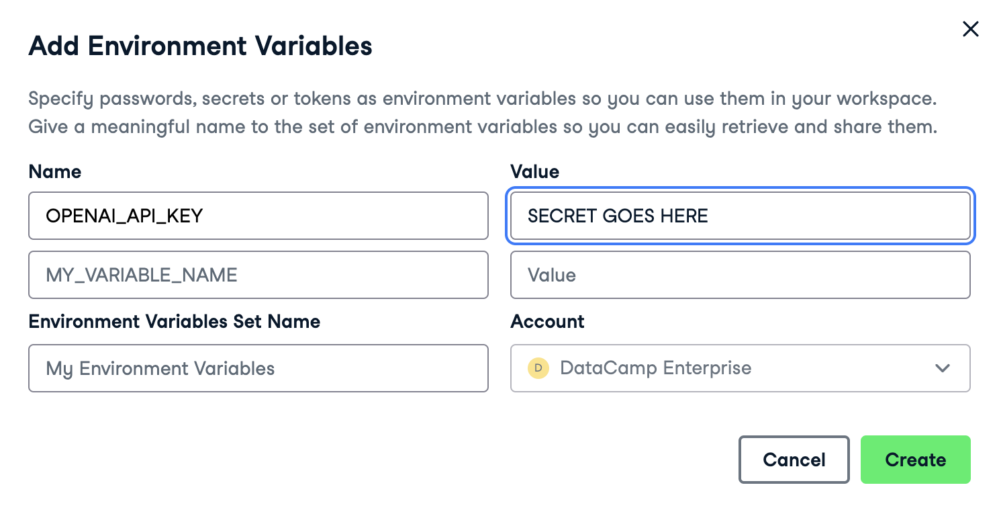

Medical professionals often summarize patient encounters in transcripts written in natural language, which include details about symptoms, diagnosis, and treatments. These transcripts can be used for other medical documentation, such as for insurance purposes, but as they are densely packed with medical information, extracting the key data accurately can be challenging.  

You and your team at Lakeside Healthcare Network have decided to leverage the OpenAI API to automatically extract medical information from these transcripts and automate the matching with the appropriate ICD-10 codes. ICD-10 codes are a standardized system used worldwide for diagnosing and billing purposes, such as insurance claims processing.

## The Data
The dataset contains anonymized medical transcriptions categorized by specialty.

## transcriptions.csv
| Column     | Description              |
|------------|--------------------------|
| `"medical_specialty"` | The medical specialty associated with each transcription.  |
| `"transcription"` | Detailed medical transcription texts, with insights into the medical case. |

## Before you start

In order to complete the project you will need to create a developer account with OpenAI and store your API key as a secure environment variable. Instructions for these steps are outlined below.

### Create a developer account with OpenAI

1. Go to the [API signup page](https://platform.openai.com/signup). 

2. Create your account (you'll need to provide your email address and your phone number).

3. Go to the [API keys page](https://platform.openai.com/account/api-keys). 

4. Create a new secret key.

5. **Take a copy of it**. (If you lose it, delete the key and create a new one.)

### Add a payment method

OpenAI sometimes provides free credits for the API, but this can vary depending on geography. You may need to add debit/credit card details. 

**This project should cost less than 10 US cents with GPT-3.5-Turbo (but if you rerun tasks, you will be charged every time).**

1. Go to the [Payment Methods page](https://platform.openai.com/account/billing/payment-methods).

2. Click Add payment method.

3. Fill in your card details.

### Add an environmental variable with your OpenAI key

1. In the workbook, click on "Environment," in the left sidebar.

2. Click on the plus button next to "Environment variables" to add environment variables.

3. In the "Name" field, type "OPENAI_API_KEY". In the "Value" field, paste in your secret key.

4. Click "Create", then you'll see the following pop-up window. Click "Connect," then wait 5-10 seconds for the kernel to restart, or restart it manually in the Run menu.

